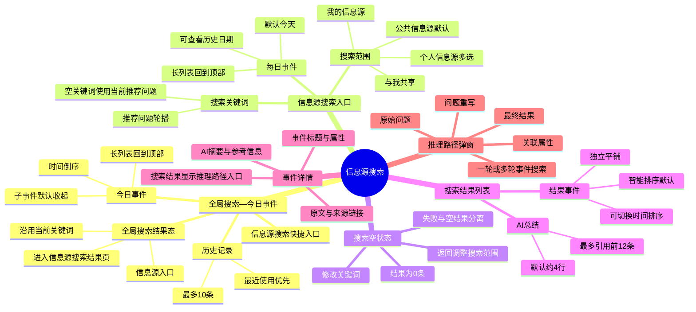
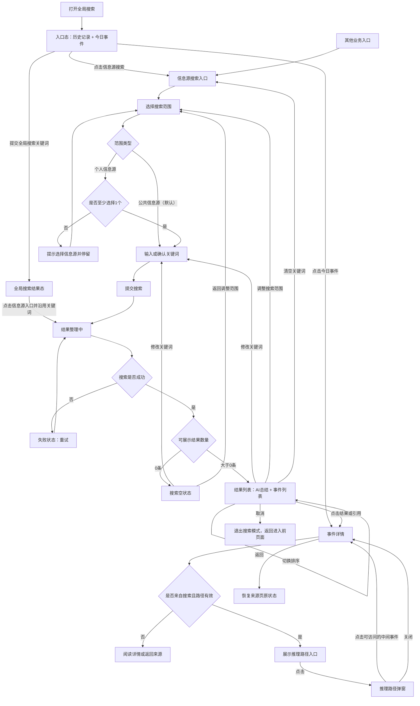
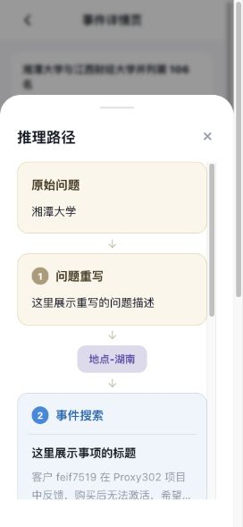

# 信息源搜索需求文档（移动端）

> 面向设计、开发与测试。仅描述关键业务、按钮级功能、用户路径、默认规则和极值交互，不包含接口字段、数据类型或视觉规格。

## 0. 范围与通用规则

本期包含：全局搜索—今日事件、信息源搜索入口、搜索空状态、搜索结果列表、事件详情、推理路径弹窗。

- 信息源搜索及其后续页面均为二级页面，不展示底部一级导航。
- 返回时回到实际调用页面或浮层，并保留调用页的关键词、筛选、展开状态、排序和滚动位置。
- 用户连续发起多次搜索时，只展示最后一次搜索结果，较早请求不得覆盖新结果。
- 内容失效、被删除或无权限时不展示受限正文；加载失败不能显示成“暂无结果”。
- 非必填内容缺失时隐藏对应内容，不展示空标签、空区块或默认占位值。

### 0.1 功能结构图

### 0.2 总流程图

---

## 1. 全局搜索入口—今日事件

### 1.1 功能目标

用户未输入关键词时，通过今日事件快速浏览当天重点内容，并可进入信息源搜索。

### 1.2 关键业务逻辑（按钮级）

| 按钮/操作点 | 业务规则 |
| --- | --- |
| 搜索输入框 | 输入并提交关键词后进入全局搜索结果态 |
| 清空搜索 | 清空当前关键词并回到入口态 |
| 取消 | 关闭全局搜索，回到打开它的页面 |
| 历史关键词 | 点击后直接以该词搜索，并移动到历史记录首位 |
| 清空历史 | 删除全部历史关键词 |
| 展开/收起历史 | 展示或收起超出首行的历史关键词 |
| 信息源搜索 | 关闭全局搜索并进入信息源搜索入口 |
| 结果态—信息源 | 关闭全局搜索结果态，沿用当前关键词进入信息源搜索结果页 |
| 事件主体 | 打开对应事件详情 |
| X 个相关子事件 | 展开或收起当前总结事件 |
| 子事件 | 打开对应子事件详情 |
| 回到顶部 | 将今日事件列表滚动至顶部 |

### 1.3 交互逻辑（用户路径与状态）

#### 默认状态与极值

- 搜索关键词默认空；只输入空格视为空关键词，不发起搜索。关键词为空时不展示清空按钮。
- 历史记录最多保留 **10 条**且自动去重；超过一行默认收起，不超过一行不展示展开按钮。
- 总结事件默认收起；子事件数量为当前可访问数量，无子事件时不展示展开按钮。
- 事件标题缺失时不展示该事件；摘要、来源或时间缺失时隐藏对应内容。
- 信息源搜索入口始终保留；今日事件为空或失败时仍可使用。
- 全局搜索结果态的“信息源”入口固定展示在结果分类入口末尾；全局搜索其他分类无结果时仍保留。
- 今日事件按**发生时间倒序**；时间相同时按入库时间倒序；仍相同时保持服务端顺序。
- 当天事件不设展示总数上限，长列表纵向滚动。
- 列表未超出可视范围或仍位于顶部时，不展示“回到顶部”；向下滚动超过统一阈值后展示。

#### 路径 A：打开全局搜索并浏览今日事件

1. 用户打开全局搜索，默认进入入口态，同时加载历史记录和今日事件。
2. 今日事件加载完成后：
   - **有数据**：按默认顺序展示，所有总结事件默认收起；
   - **空数据**：保留标题和信息源搜索按钮，事件区展示空状态；
   - **加载失败**：事件区展示失败和重试，历史记录与信息源搜索仍可操作；
   - **部分字段缺失**：隐藏缺失的摘要、来源或时间，不生成空内容。
3. 用户展开某条事件时，只改变该事件状态；其他事件保持原状态。
4. 长列表向下滚动超过阈值后出现“回到顶部”；点击后滚动至今日事件列表顶部并隐藏按钮，事件展开状态保持不变。

#### 路径 B：从今日事件进入详情

1. 用户点击事件主体或子事件进入详情。
2. 打开前若事件已删除或无权限，停留当前页并提示不可用。
3. 从详情返回时，恢复全局搜索入口态、历史记录状态、事件展开状态和滚动位置。

#### 路径 C：使用历史关键词或输入关键词

1. 点击历史关键词或提交非空关键词，进入全局搜索结果态。
2. 结果态固定展示“信息源”入口；点击后关闭全局搜索，沿用当前关键词进入信息源搜索结果页。
3. 信息源搜索结果页先展示“结果整理中”，完成后进入有结果、空结果或失败状态。
4. 连续提交多个关键词时，只保留最后一次请求结果；点击“信息源”时使用最后一次已提交关键词。
5. 清空关键词后回到入口态，今日事件重新按当前状态展示；结果态“信息源”入口随结果态一同关闭。

---

## 2. 信息源搜索入口

### 2.1 功能目标

用户可输入问题、选择搜索范围，也可按日期浏览每日事件。

### 2.2 关键业务逻辑（按钮级）

| 按钮/操作点 | 业务规则 |
| --- | --- |
| 返回 | 返回实际调用页面或浮层 |
| 搜索输入框 | 承载用户问题；提交后发起信息源搜索 |
| 搜索提交 | 校验关键词和搜索范围，校验通过后进入结果页 |
| 搜索范围 | 打开搜索范围选择 |
| 公共信息源 | 搜索全部可访问公共信息源 |
| 个人信息源 | 搜索用户确认选择的信息源 |
| 我的信息源 | 查看用户自建或归属用户的信息源 |
| 与我共享 | 查看他人共享给用户的信息源 |
| 信息源名称搜索 | 在当前清单内按名称过滤 |
| 已选 | 只查看已选择的信息源 |
| 信息源勾选 | 选择或取消个人信息源 |
| 取消/关闭范围 | 放弃本次临时修改 |
| 确认范围 | 保存本次范围和已选信息源 |
| 往期事件 | 打开日期选择 |
| 上月/下月 | 切换日历月份 |
| 日期 | 加载所选日期的每日事件 |
| 事件/子事件 | 打开详情或切换子事件展开状态 |
| 回到顶部 | 将每日事件列表滚动至顶部 |

### 2.3 交互逻辑（用户路径与状态）

#### 默认状态与极值

- 默认范围为**公共信息源**，无需逐个选择；默认日期为**今天**。
- 搜索框默认空并轮播推荐问题；输入后停止轮播，空关键词提交时使用当前推荐问题。
- 个人信息源默认打开“我的信息源”，至少选择 **1 个**，当前不设选择上限；已选数量跨分类去重。
- “与我共享”仅企业版展示；分类或筛选结果为 0 时展示对应空状态，不清空已选项。
- 日期选择默认定位当前事件月份；未来日期及未来月份不可选。
- 提交搜索期间不可重复提交；返回时恢复实际调用页状态。
- 每日事件未超出可视范围或仍位于顶部时不展示“回到顶部”；向下滚动超过统一阈值后展示。

#### 路径 A：使用公共信息源搜索

1. 用户进入页面，默认范围为公共信息源、日期为今天、关键词为空。
2. 用户输入问题；若未输入，提交时使用当前轮播的推荐问题。
3. 点击提交后：
   - **校验通过**：按钮进入提交中并防止重复点击，随后进入结果页；
   - **请求较慢**：结果页持续展示“结果整理中”；
   - **请求失败**：展示失败和重试，不进入空状态。

#### 路径 B：使用个人信息源搜索

1. 用户打开搜索范围并切换到个人信息源。
2. 信息源清单存在以下状态：
   - **加载中**：保留已有选择，暂不可确认；
   - **有数据**：支持跨分类多选、名称搜索和仅看已选；
   - **分类为空**：分别展示“暂无自建信息源”或“暂无共享给你的信息源”；

     **我的信息源为空**

     

     **与我共享为空**

     

   - **加载失败**：展示重试，不丢失打开弹窗前的正式范围。
3. 用户选择后点击确认：
   - **已选 ≥1 个**：保存并回显“个人信息源 · N 个”；
   - **已选 0 个**：提示至少选择一个，弹窗保持打开；

     

   - **部分信息源已失效**：确认或搜索前剔除并更新数量；剔除后为 0 则阻止搜索。
4. 用户点击取消或关闭时，不保存临时选择。

#### 路径 C：浏览每日/往期事件

1. 默认加载今天事件，按时间倒序展示。
2. 用户打开往期事件并选择有效日期，关闭日期选择后加载对应事件。
3. 切换日期后：
   - **加载中**：事件区展示加载反馈；
   - **有数据**：展示新日期事件，默认全部收起；
   - **无数据**：展示该日期无事件；
   - **失败**：保留已选日期并提供重试。
4. 未来日期不可点击，当前月不提供进入下月的有效操作。
5. 长列表中点击“回到顶部”后滚动至每日事件列表顶部并隐藏按钮；当前日期及事件展开状态不变。

---

## 3. 信息源搜索空状态

### 3.1 功能目标

明确区分“搜索完成但无结果”和“搜索失败”，支持用户修改关键词后继续搜索。

### 3.2 关键业务逻辑（按钮级）

| 按钮/操作点 | 业务规则 |
| --- | --- |
| 返回 | 返回实际调用页；来自信息源搜索入口时回到入口 |
| 搜索输入框 | 回显本次实际搜索关键词，可直接编辑 |
| 清空 | 只清空输入框并保持输入状态 |
| 键盘提交 | 以编辑后的关键词重新搜索 |
| 重试 | 搜索失败时重新执行原搜索 |

### 3.3 交互逻辑（用户路径与状态）

#### 默认状态与极值

- 只有搜索成功且可展示结果为 **0 条**时进入空状态，并保留本次关键词和搜索范围。
- 空状态不展示 AI 总结、排序控件、事件占位卡和重试按钮。
- 清空按钮只清空输入框，不立即离开空状态；提交空关键词后才返回入口。
- 失败状态展示重试并沿用当前关键词和范围；不得使用空状态代替失败。

#### 路径 A：首次出现空结果

1. 搜索完成后判断可展示结果数量。
2. **结果为 0 条**：展示空状态并保留关键词。
3. 命中内容全部因删除、无权限或过滤而不可展示时，也按 0 条处理。
4. **超时、网络或服务错误**：进入失败状态，不显示“暂无搜索结果”。

#### 路径 B：修改关键词重新搜索

1. 用户编辑非空关键词并提交，空状态被“结果整理中”替换。
2. 完成后分别进入：有结果列表、再次空结果或失败状态。
3. 用户连续提交时，只展示最后一次关键词结果。

#### 路径 C：返回调整搜索范围

1. 用户点击返回，回到信息源搜索入口并保留原范围。
2. 用户可重新打开范围选择后再次搜索。
3. 用户清空关键词并提交时，同样返回入口；输入框恢复推荐问题状态。

---

## 4. 信息源搜索结果列表页

### 4.1 功能目标

展示搜索结果的整体结论和独立事件列表，支持排序、重新搜索和进入详情。

### 4.2 关键业务逻辑（按钮级）

| 按钮/操作点 | 业务规则 |
| --- | --- |
| 取消 | 退出信息源搜索模式，返回进入搜索前的业务页面 |
| 搜索输入框 | 回显当前关键词，可编辑后重新搜索 |
| 清空 | 清空当前关键词并返回信息源搜索初始页；保留已确认范围 |
| 搜索范围 | 打开范围选择；确认范围变更后沿用当前关键词重新搜索 |
| AI 总结引用序号 | 打开引用对应的事件详情 |
| 更多 | 打开完整 AI 总结 |
| 关闭 AI 总结 | 关闭完整总结并返回列表 |
| 智能排序/时间排序 | 在两种排序间切换 |
| 结果事件 | 打开对应事件详情 |
| 总结重试 | AI 总结生成失败时单独重试 |
| 搜索重试 | 完整搜索失败时重试 |

### 4.3 交互逻辑（用户路径与状态）

#### 默认状态与极值

- 默认先展示“结果整理中”；有结果后默认采用**智能排序**，每次重新搜索均恢复智能排序。
- 搜索范围默认回显本次搜索使用的范围；范围名称过长时单行省略，不隐藏入口。
- AI 总结默认约 **4 行**，最多引用前 **12 条**有效结果；引用目标不随列表排序改变。
- 结果事件全部独立平铺，不展示子事件展开入口；结果很多时按服务端分页或连续加载。
- 点击清空立即返回信息源搜索初始页；入口关键词为空，已确认搜索范围保持不变。
- AI 总结失败只重试总结，不重新搜索；完整搜索失败沿用当前关键词和范围重试。
- 关闭完整总结时，恢复当前排序和滚动位置；点击取消则直接退出搜索模式。
- 智能排序按相关度倒序，相关度相同时按发生时间倒序；时间排序按发生时间倒序，时间相同时按相关度倒序。
- 排序条件仍相同时保持服务端顺序；结果序号从 1 连续生成，切换排序后同步更新。
- 新加载结果并入当前排序，不改变用户已选的排序方式。

#### 路径 A：进入结果页

1. 页面默认先展示“结果整理中”，不把上一次总结和列表当作新结果展示。
2. 搜索完成后：
   - **结果 >0 且总结成功**：展示 AI 总结、排序和结果列表；
   - **结果 >0 但总结生成中**：先展示列表，总结完成后原位更新；
   - **结果 >0 但总结失败**：列表正常使用，总结区域提供重试；
   - **结果 =0**：进入第 3 节空状态；
   - **搜索失败**：展示失败和完整搜索重试。

#### 路径 B：清空并返回入口

1. 用户点击输入框右侧清空按钮。
2. 系统清空结果页和入口页关键词，立即返回信息源搜索初始页。
3. 初始页恢复推荐问题状态，保留已确认的公共或个人信息源范围。

#### 路径 C：取消搜索

1. 用户点击搜索框右侧“取消”。
2. 系统关闭结果页及关联搜索浮层，返回进入信息源搜索前的业务页面。
3. 不返回信息源搜索初始页，不展示二次确认。

#### 路径 D：切换排序和浏览结果

1. 默认智能排序。
2. 点击排序按钮后切换为时间排序，再次点击切回智能排序。
3. 切换后列表立即重排并更新序号；返回详情时仍保持当前排序和滚动位置。
4. 事件字段缺失时隐藏对应摘要、来源或时间；标题缺失的事件不进入列表。

#### 路径 E：调整搜索范围

1. 用户点击当前搜索范围，打开范围选择并回显已确认范围和已选信息源。
2. 用户取消或关闭弹窗，范围和当前结果不变。
3. 用户确认范围：
   - **范围未变化**：关闭弹窗，保持当前结果和滚动位置；
   - **范围已变化**：保留当前关键词并重新进入“结果整理中”，完成后替换总结和列表；
   - **个人信息源已选 0 个**：提示至少选择一个，弹窗保持打开。

#### 路径 F：从结果进入详情

1. 用户点击结果卡或 AI 总结引用进入对应事件详情。
2. 打开前事件失效：留在列表并提示，同时移除该事件、更新总数和序号。
3. 移除后结果变为 0 条：切换为空状态。
4. 从详情返回：恢复当前关键词、排序、已加载结果和滚动位置。

#### 路径 D：重新搜索

1. 编辑非空关键词并提交，覆盖当前内容为“结果整理中”。
2. 新搜索完成后排序恢复为智能排序，序号重新生成。
3. 提交空关键词时返回信息源搜索入口，并保留已确认范围。

---

## 5. 事件详情页

### 5.1 功能目标

统一展示事件完整内容，并根据来源决定是否提供推理路径。

### 5.2 关键业务逻辑（按钮级）

| 按钮/操作点 | 业务规则 |
| --- | --- |
| 返回 | 返回打开详情的页面或浮层 |
| 属性展开/收起 | 查看全部属性或恢复单行 |
| 查看链接 | 打开事件原始来源 |
| 推理路径 | 打开当前搜索对应的推理路径 |
| 详情重试 | 详情加载失败时重新获取 |

内容顺序为：事件标题、属性信息、AI 摘要、参考信息、原文参考、原始来源链接。AI 摘要和原文完整展示，通过页面滚动阅读。

### 5.3 交互逻辑（用户路径与状态）

#### 默认状态与极值

- 详情默认定位页面顶部；内容按固定顺序展示，缺失项直接隐藏。
- 属性默认单行收起；属性为空时不展示展开按钮，属性很多时展开后不丢弃内容。
- AI 摘要和原文不折叠，长内容通过页面纵向滚动阅读。
- 原始来源链接缺失时不展示；链接失效时留在详情并提示。
- 推理路径入口仅在搜索结果且路径有效时展示；向下连续滚动时隐藏，向上或回到顶部时恢复。
- 返回时恢复来源页的排序、筛选、展开和滚动状态。

#### 路径 A：打开并阅读详情

1. 打开后默认定位页面顶部并进入加载状态。
2. 加载完成后：
   - **成功**：按固定内容顺序展示，有缺失项时直接跳过；
   - **失败**：展示失败、重试和返回；
   - **事件不存在**：展示内容不可用，只保留返回；
   - **无权限**：不展示受限正文，只保留说明和返回。
3. 长摘要和长原文不折叠，页面纵向滚动。

#### 路径 B：查看全部属性

1. 属性默认单行展示，内容超出时截断。
2. 点击展开后展示全部属性，不推动或重置正文阅读位置。
3. 再次点击或点击属性区域外收起。
4. 属性数量极多时，全部属性区域自身按产品统一承载方式展示，不丢弃属性。

#### 路径 C：查看推理路径

1. 搜索结果且路径有效时展示入口；其他事件不展示。
2. 向下连续滚动超过统一阈值时隐藏入口；向上滚动或回到顶部时恢复。
3. 点击后打开推理路径弹窗；关闭时恢复详情滚动位置和入口显隐状态。

#### 路径 D：返回来源

1. 从全局搜索今日事件进入，返回全局搜索入口态。
2. 从信息源搜索每日事件进入，返回原日期和展开状态。
3. 从结果列表进入，返回原关键词、排序和滚动位置。
4. 从其他来源浮层进入，返回原浮层，不暴露更下层页面。

---

## 6. 事件详情页—推理路径弹窗

### 6.1 功能目标

解释当前搜索结果如何从原始问题经过问题重写、事件搜索和筛选形成最终结果。

### 6.2 关键业务逻辑（按钮级）

| 按钮/操作点 | 业务规则 |
| --- | --- |
| 关闭 | 关闭弹窗并返回原事件详情 |
| 弹窗外区域 | 与关闭按钮一致 |
| 中间事件步骤 | 有权限时打开对应事件详情 |
| 路径重试 | 路径加载失败时重新获取 |

### 6.3 交互逻辑（用户路径与状态）

#### 默认状态与极值

- 弹窗默认定位路径顶部；路径超长时只滚动弹窗，背后详情不滚动。
- 事件搜索轮数不固定，步骤序号按真实路径连续生成；缺失步骤不补造。
- 部分路径只展示真实返回内容；原始问题缺失时按无路径处理。
- 中间事件无权限或已失效时不可进入，弹窗保持打开并提示。
- 加载或重试期间仍可关闭；关闭后恢复详情滚动位置和推理路径入口状态。

#### 路径 A：打开推理路径

1. 用户点击详情页推理路径按钮，弹窗默认定位顶部并加载当前事件路径。
2. 加载完成后：
   - **完整路径**：展示原始问题、问题重写、至少一轮事件搜索和最终结果；
   - **部分路径**：只展示真实返回步骤，并提示路径不完整；
   - **无路径**：关闭弹窗并提示暂无法查看；
   - **加载失败**：弹窗内展示失败和重试，背后事件详情仍可用。
3. 原始问题缺失时无法关联本次搜索，按无路径处理。

#### 路径 B：浏览长路径

1. 事件搜索轮数不固定，步骤序号按实际步骤连续生成。
2. 同一关联节点可包含多个属性，按返回顺序展示，不重新排序。
3. 路径超出可视区域时只滚动弹窗，背后详情不滚动。

#### 路径 C：进入中间事件

1. 点击可访问的中间事件，关闭当前弹窗并打开该事件详情。
2. 从中间事件详情返回时，重新打开原推理路径并恢复原滚动位置。
3. 中间事件无权限或已失效时，弹窗保持打开并提示不可用。

#### 路径 D：关闭弹窗

1. 点击关闭按钮或弹窗外区域返回原事件详情。
2. 关闭后恢复详情原滚动位置和推理路径入口显隐状态。
3. 当前事件在弹窗打开期间失效时，关闭弹窗并将详情切换为不存在或无权限状态。

---

## 7. 验收重点

- 每个按钮均有明确的触发条件、结果、默认状态和不可用状态。
- 默认值明确：公共信息源、今天、事件收起、智能排序、AI 总结约 4 行、推理路径从顶部开始。
- 数量明确：历史记录最多 10 条；AI 总结最多引用前 12 条；结果为 0 条才进入空状态。
- 顺序明确：今日事件按时间倒序、子事件按序号正序、搜索结果默认按相关度倒序。
- 状态明确：加载、成功、空、失败、无权限不得混用。
- 用户路径明确：进入、操作、异常、返回均能恢复到可预期状态。
