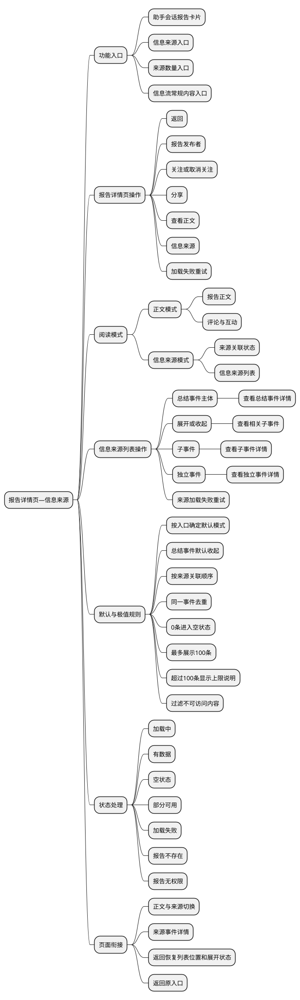
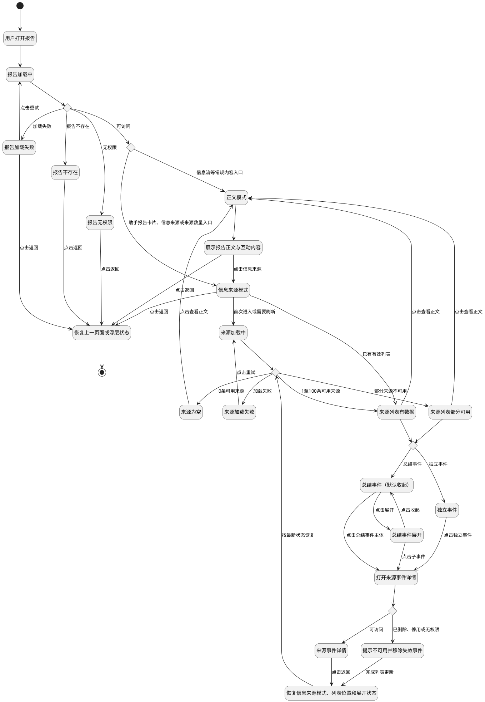

# 报告详情页—信息来源需求文档（移动端）

> 面向对象：产品、设计、客户端开发、服务端开发与测试。
>
> 本文描述页面需要承载的业务信息、状态与交互结果，不涉及接口字段、数据类型、埋点、组件尺寸、颜色、字号等技术或视觉设计细节。

## 0. 文档范围

本期包含以下两个功能点：

1. 报告详情页—信息来源模式；
2. 信息来源列表。

### 0.1 核心概念

- **报告**：由系统或助手基于一组事件归纳生成的内容，可在详情页查看报告正文及支撑报告结论的信息来源。
- **正文模式**：报告详情页内用于阅读报告正文及参与报告互动的模式。
- **信息来源模式**：报告详情页内与正文模式并列的阅读模式，仅展示当前报告关联的信息来源列表。
- **来源事件**：被当前报告引用或用于支撑报告结论的事件，包括总结事件、其下的子事件以及无上下级关系的独立事件。
- **总结事件**：对一组相关事件的聚合，可包含多个子事件。
- **子事件**：总结事件下可独立查看详情的事件。
- **独立事件**：没有在当前来源列表中归属于总结事件的事件。

### 0.2 全局规则

- 页面只展示当前用户有权访问的报告和来源事件；内容在加载期间失去权限时，按无权限或不可用状态处理。
- 报告与来源事件的关联关系只用于说明报告依据，不改变事件在其他页面中的归属、状态或排序。
- 同一报告在正文模式和信息来源模式之间切换时，报告身份、发布者、关注状态及分享对象保持一致。
- 除特别说明外，页面信息无内容时不展示对应内容，不使用空白占位或无意义默认值补齐。
- 文中“页面信息”仅指页面承载的业务内容，不代表接口或存储结构。

### 0.3 功能结构图

### 0.4 总流程图

---

## 1. 报告详情页—信息来源模式

### 1.1 功能目标

在报告详情页内提供与报告正文并列的信息来源模式，使用户能够直接核对支撑报告结论的事件，并在报告正文、来源列表和来源事件详情之间连续阅读，同时不丢失当前报告的浏览状态。

### 1.2 业务逻辑

#### 1.2.1 页面信息

- **返回入口**：返回打开当前报告的上一页面或上一浮层。
- **报告发布者标识**：用于识别报告发布者或生成报告的助手；无可用标识时展示通用替代标识。
- **报告发布者名称**：当前报告的发布者或生成报告的助手名称。
- **关注状态**：当前用户是否已关注报告发布者，包括“未关注”和“已关注”。
- **分享入口**：用于分享当前报告；分享对象始终是报告本身，不因当前处于信息来源模式而改为分享某条来源事件。
- **正文模式入口**：切换到当前报告的正文内容。
- **信息来源模式入口**：切换到当前报告关联的信息来源列表。
- **当前阅读模式**：正文模式或信息来源模式，任一时刻只能有一个模式生效。
- **来源关联状态**：当前报告是否存在可供用户查看的来源事件。
- **信息来源列表**：当前报告关联且用户有权查看的来源事件集合，列表信息及层级规则见第 2 节。
- **来源上下文**：记录报告由哪个页面或浮层打开，用于返回时恢复正确入口状态。

#### 1.2.2 关键业务逻辑（按钮级）

| 按钮或可点击区域 | 生效条件 | 点击后的业务处理 | 业务边界 |
| --- | --- | --- | --- |
| 返回 | 报告详情已打开 | 返回实际打开报告的上一页面或上一浮层，并携带来源上下文 | 对所有报告状态生效；返回目标不得固定为首页 |
| 报告发布者 | 报告可访问且发布者可识别 | 打开当前报告发布者主页 | 只处理当前报告对应的发布者 |
| 关注 | 报告可访问、当前为未关注且发布者支持关注 | 为当前用户建立对报告发布者的关注关系 | 关注对象固定为当前报告发布者 |
| 已关注 | 报告可访问、当前为已关注 | 解除当前用户与报告发布者的关注关系 | 只解除当前报告发布者的关注关系 |
| 分享 | 报告可访问且报告允许分享 | 打开当前报告的分享能力 | 分享对象固定为报告，不替换为当前来源事件 |
| 查看正文 | 当前处于信息来源模式 | 切换至同一报告的正文模式 | 不重新选择或生成报告 |
| 信息来源 | 当前处于正文模式 | 切换至同一报告的信息来源模式，并按需获取来源 | 来源范围固定为当前报告的关联事件 |
| 报告重试 | 报告加载失败 | 重新加载当前报告并再次校验权限 | 只重试报告数据与访问权限 |
| 来源重试 | 报告可访问且来源加载失败 | 重新获取当前报告的来源关系和来源事件 | 不重新生成报告或正文 |

#### 1.2.3 状态定义与处理

- **报告加载中**：正在确认报告内容及访问权限；不展示上一份报告的发布者、模式内容或来源列表。
- **报告可访问—来源待加载**：报告可正常打开，但来源关系仍在获取；允许返回、切换正文模式、关注和分享，来源区域保持加载中。
- **报告可访问—来源有数据**：至少存在一条可访问来源事件；按第 2 节规则展示列表。
- **报告可访问—来源为空**：报告未关联来源，或关联来源全部已删除、停用、无权限或被内容安全规则过滤；报告正文仍可查看，信息来源模式进入空状态。
- **报告可访问—来源加载失败**：报告本身可用，但来源关系获取失败；不影响正文、关注和分享，信息来源模式提供重试能力。
- **报告可访问—来源部分可用**：部分来源加载失败或失效；展示可用来源，并说明部分内容暂不可用，不以失败项占位补齐列表。
- **报告不存在**：报告已删除或标识无效；不展示报告正文、发布者信息、来源列表及操作能力，只保留内容不可用说明和返回入口。
- **报告无权限**：报告仍存在但当前用户不可访问；不展示报告正文、发布者信息、来源列表及操作能力，只保留无权限说明和返回入口。
- **正文模式生效**：展示报告正文相关内容及报告原有互动内容；信息来源列表不展示。
- **信息来源模式生效**：展示来源列表对应状态；报告正文和报告互动内容不展示。
- **模式切换中**：若目标模式数据尚未就绪，只更新目标区域为加载中，不短暂展示另一份报告或上一次加载的数据。

### 1.3 交互逻辑

#### 1.3.1 路径一：从来源相关入口打开报告

1. 用户在助手会话点击报告卡片“查看报告”，或点击“信息来源”“来源数量”。
2. 页面先进入报告加载中，只展示返回入口和当前报告加载反馈，不展示上一份报告内容。
3. 报告加载完成后默认进入信息来源模式；每次新打开报告都按本次入口重新确定模式，不沿用上一份报告最后停留的模式。
4. 信息来源模式只展示报告级操作、模式入口和来源区域，不展示报告封面、标题、摘要、正文、评论区及点赞、收藏、评论操作。
5. 根据来源状态展示：
   - **来源加载中**：展示报告发布者、关注、分享、模式入口和来源加载反馈；不展示旧列表、空状态或失败说明。
   - **来源有数据**：展示报告级操作和按默认顺序生成的来源列表；不展示报告正文、评论及底部互动。
   - **来源为空**：展示“该报告暂未关联可查看的信息来源”和“查看正文”能力；不生成空白来源卡片或数量占位。
   - **来源部分可用**：展示可用来源及部分内容不可用说明；失效来源不占空位，也不阻止其他来源查看。
   - **来源加载失败**：展示失败说明和来源重试；不使用“暂无来源”代替失败，也不展示上一次成功列表。
   - **报告不存在或无权限**：只展示对应说明和返回入口，不展示发布者、关注、分享、模式入口、正文或来源列表。
6. 若用户在报告或来源加载失败状态点击重试，页面回到对应加载中；成功后进入实际状态，失败则继续保留失败与重试能力。

#### 1.3.2 路径二：从正文模式查看信息来源并往返

1. 用户从信息流等常规入口打开报告，默认进入正文模式。
2. 用户点击“信息来源”，页面切换到信息来源模式；首次进入定位到列表起点并加载来源。
3. 用户点击“查看正文”，返回同一报告的正文模式；来源列表停止展示，但本次打开期间保留列表位置和展开状态。
4. 用户再次点击“信息来源”时：
   - **来源数据未变化且仍有效**：直接恢复离开前的列表位置和展开状态。
   - **来源仍在加载**：展示来源加载反馈，完成后停留在信息来源模式并更新结果。
   - **来源已更新**：保留仍存在事件的相对顺序和展开状态，移除失效事件，新事件按最新来源关联顺序加入。
   - **快速连续切换模式**：始终展示最后一次点击对应的模式，异步返回不得把页面切回较早模式。
   - **来源加载中切回正文**：立即展示正文；来源完成后不自动打断正文阅读，再次进入信息来源时展示最新结果。

#### 1.3.3 路径三：使用报告级操作

- **查看发布者**：用户点击发布者后进入其主页；发布者不可用时留在当前模式并提示，来源浏览状态不变。
- **关注或取消关注**：用户点击后进入提交中，期间不可重复触发；成功后更新状态，失败则恢复操作前状态。无论结果如何，当前模式和阅读位置不变。
- **分享报告**：用户点击分享后，分享对象始终是当前报告；分享成功、取消或失败均不改变模式、列表位置和展开状态。分享过程中报告失效时停止分享并提示不可用。

#### 1.3.4 路径四：退出报告详情

- 用户在正文、来源有数据、来源为空、来源部分可用或来源加载失败状态点击返回，回到实际打开报告的上一页面或上一浮层，并恢复其滚动位置、会话状态和已读状态。
- 用户在报告加载中点击返回，立即退出当前报告；后续加载结果不得再次打开报告或覆盖上一页面。
- 用户在报告不存在或无权限状态点击返回，仍按来源上下文返回，不跳转固定首页。
- 用户退出报告后，本次列表位置、模式和展开状态不跨会话保留；再次打开时重新按入口确定默认模式。

---

## 2. 信息来源列表

### 2.1 功能目标

以稳定、可追溯的层级列表展示当前报告采用的来源事件，帮助用户区分总结事件、相关子事件和独立事件，并能进入任一可访问事件查看完整依据。

### 2.2 业务逻辑

#### 2.2.1 列表信息

- **来源事件类型**：总结事件、子事件或独立事件，决定事件在列表中的层级及是否具有展开能力。
- **来源事件标题**：来源事件的核心主题，用于识别具体依据。
- **来源事件摘要**：来源事件的简要说明，用于在进入详情前判断其与报告的关系。
- **相关子事件数量**：总结事件下当前用户可查看且计入本次列表的子事件数量；无可查看子事件时不展示。
- **展开状态**：每条总结事件各自的收起或展开状态。
- **来源事件可访问状态**：当前用户是否仍可打开该事件详情。
- **来源关联顺序**：当前报告引用或采用各来源事件的先后顺序，用于确定列表默认顺序。
- **列表展示数量**：本次实际展示的总结事件、子事件和独立事件合计数量。
- **展示上限状态**：可访问来源事件是否超过 100 条，用于决定是否展示“仅展示前 100 条”的说明。

#### 2.2.2 关键业务逻辑（按钮级）

| 按钮或可点击区域 | 生效条件 | 点击后的业务处理 | 业务边界 |
| --- | --- | --- | --- |
| 总结事件主体 | 总结事件可访问 | 打开该总结事件详情 | 与展开或收起功能相互独立 |
| 展开相关子事件 | 总结事件至少有 1 条可展示子事件且当前收起 | 读取并展示当前总结事件下的可访问子事件 | 只作用于当前总结事件 |
| 收起 | 总结事件当前已展开 | 隐藏当前总结事件下的子事件 | 不删除子事件或改变来源关系 |
| 子事件 | 子事件可访问且所属总结事件已展开 | 打开该子事件详情 | 详情对象固定为当前子事件 |
| 独立事件 | 独立事件可访问 | 打开该独立事件详情 | 独立事件不具备层级展开能力 |
| 来源重试 | 列表加载失败 | 重新获取当前报告的来源关系和来源事件 | 只重试当前报告的来源列表 |

#### 2.2.3 数据过滤、去重与排序规则

- 列表先过滤已删除、停用、无权限、被内容安全规则过滤及标题缺失的事件，再去重、排序和计算展示数量。
- 同一来源事件被报告重复关联时只展示一次，保留其第一次出现的来源关联顺序；重复项不重复计数。
- 顶层列表按报告的来源关联顺序正序排列，先被报告引用或采用的来源在前；不按事件发生时间、创建时间或标题重新排序。
- 两条顶层事件的来源关联顺序相同时，保持服务端返回顺序，避免刷新后顺序跳动。
- 总结事件与其子事件作为一个连续分组展示；子事件只能出现在所属总结事件下，不提升为顶层事件，也不与其他顶层事件交叉排列。
- 同一总结事件下的子事件按报告采用顺序正序排列；报告未提供独立采用顺序时，按事件原有业务序号正序排列；仍无法区分时保持服务端返回顺序。
- 同一子事件重复关联时只在所属总结事件下保留一次；同一事件同时以顶层和子事件身份返回时，以报告确认的层级关系为准，不重复展示。
- 独立事件按顶层来源关联顺序参与排列，不提供展开入口。
- 相关子事件数量只统计当前用户可访问、标题有效且去重后的子事件，不暴露无权限内容数量；最终展示数量再受交互层的 100 条上限约束。

#### 2.2.4 状态定义与处理

- **列表加载中**：正在获取或整理来源事件；不展示上一份报告的列表。
- **列表有数据**：至少存在一条可访问且标题有效的来源事件；按默认顺序和层级展示。
- **列表为空**：没有关联来源，或关联来源全部不可展示；显示来源为空说明，不生成示例事件。
- **列表加载失败**：来源事件未能获取；显示失败说明和重试能力，不把失败处理为空列表。
- **列表部分可用**：部分来源事件获取失败或失效；保留其余可用事件的原有相对顺序，并展示部分内容不可用说明。
- **总结事件收起**：展示总结事件标题、可用摘要和相关子事件数量，不展示子事件内容。
- **总结事件展开**：在总结事件下展示上限范围内的全部可访问子事件，并将操作状态更新为可收起。
- **总结事件无可用子事件**：按不含子事件的来源事件展示，不显示数量及展开能力。
- **独立事件**：展示标题和可用摘要，不显示相关子事件数量及展开能力。
- **来源事件标题缺失**：该事件不进入列表；若为总结事件，其子事件也不脱离父级单独展示。
- **来源事件摘要缺失**：只展示标题及适用的子事件数量或展开状态，仍允许进入详情。
- **来源事件已删除、停用或无权限**：不展示其标题和摘要；若在用户点击时才发现失效，留在列表提示内容不可用，并从列表移除。
- **子事件部分失效**：只展示仍可访问的子事件，重新计算相关子事件数量；数量变为零时取消总结事件的展开能力。
- **超过展示上限**：展示前 100 条及上限说明，不提供无结果占位；本期不在列表内继续加载第 101 条及之后的来源。

### 2.3 交互逻辑

#### 2.3.1 路径一：首次浏览来源列表

1. 用户进入信息来源模式，列表先展示来源加载反馈。
2. 加载完成后先过滤不可展示事件、去重，再按来源关联顺序生成列表，并根据数量进入对应状态：
   - **0 条**：展示“该报告暂未关联可查看的信息来源”，不展示事件卡片、数量占位或展开能力。
   - **1 至 99 条**：展示全部可访问来源，不展示上限说明。
   - **100 条且实际总数为 100**：展示全部 100 条，不展示上限说明。
   - **超过 100 条**：展示前 100 条和上限说明，不提供继续加载。
   - **部分可用**：在上述数量规则基础上展示可用来源及部分内容不可用说明；失败项不占列表位置。
3. 数量统计中，总结事件本身、子事件和独立事件均各计 1 条；去重后的重复事件不重复计数。
4. 若第 100 条落在某个总结事件的子事件中，只展示上限内的子事件；当第一条为总结事件且其可访问子事件超过 99 条时，最多展示该总结事件本身和前 99 条子事件，并展示上限说明。
5. 总结事件默认收起，只展示标题、可用摘要、上限范围内的相关子事件数量和展开能力；独立事件展示标题和可用摘要，不展示展开能力。
6. 摘要缺失时只展示标题和仍适用的操作；标题缺失时事件不进入列表。总结事件标题缺失时，其子事件不脱离父级单独展示。

#### 2.3.2 路径二：展开或收起总结事件

1. 用户点击“展开相关子事件”，只展开当前总结事件，其他总结事件保持原状态。
2. 展开后的不同状态处理：
   - **子事件全部可用**：按默认子事件顺序展示全部上限范围内的子事件，并将入口更新为“收起”。
   - **子事件部分失效**：只展示仍可访问的子事件，重新计算数量；失效项不展示占位。
   - **子事件数量变为 0**：取消数量和展开能力，将该总结事件按无子事件状态展示。
   - **展开后触发 100 条上限**：只展示上限内的子事件并保留上限说明，不继续加载后续子事件。
3. 用户点击“收起”，隐藏当前总结事件下的子事件，保留总结事件信息和最新子事件数量；列表中其他事件的状态不变。
4. 用户连续点击展开或收起时，以最后一次有效点击后的状态为准；同一点击不得同时触发事件详情。

#### 2.3.3 路径三：进入来源事件详情并返回

1. 用户点击总结事件主体、已展开的子事件或独立事件，系统再次确认事件可访问状态。
2. 根据确认结果处理：
   - **事件可访问**：打开对应事件详情。
   - **事件已删除、停用或无权限**：不打开空详情，留在列表提示内容不可用，并移除该事件。
   - **失效项为子事件**：同步更新所属总结事件的子事件数量；数量为 0 时取消展开能力。
   - **失效项移除后列表为 0 条**：切换为来源空状态。
   - **失效项移除后不再超过 100 条**：取消上限说明；本期不自动补入原第 101 条，重新进入或刷新来源后按最新数据重新取前 100 条。
3. 用户从事件详情返回时，回到同一报告的信息来源模式，恢复离开前的列表位置、顺序和其他总结事件的展开状态；若数据已更新，以最新可访问状态为准。

#### 2.3.4 路径四：来源加载失败后重试

1. 来源加载失败时展示失败说明和重试入口，不展示旧列表，也不显示为空状态。
2. 用户点击重试后回到列表加载中，期间保留报告级返回、正文切换、关注和分享能力，但重试按钮不可重复触发。
3. 重试成功后按过滤、去重、排序和数量规则进入有数据、空或部分可用状态；重试仍失败则继续展示失败说明和重试入口。

#### 2.3.5 路径五：离开列表后返回

- 用户切到正文再返回信息来源时，若来源数据未变化，恢复列表位置和展开状态；若来源已更新，移除失效事件并按最新关联顺序更新，新事件默认收起。
- 用户退出报告再重新打开时，不恢复上次会话的列表位置和展开状态；按入口确定默认模式，所有总结事件重新默认收起。

---

## 3. 验收边界

- 两个功能点均需覆盖加载中、有数据或成功、无数据或不可用、失败四类基本状态；不允许使用空状态代替失败。
- 功能结构图和总流程图必须使用 PlantUML，图中入口、按钮、状态及返回路径与正文规则保持一致。
- 关键业务逻辑必须覆盖返回、发布者、关注、分享、模式切换、重试、事件主体、展开收起及事件详情等全部可点击功能点。
- 交互逻辑必须按用户使用路径描述，并在每条路径内明确加载中、成功、空、部分可用、失败、失效及无权限的差异处理。
- 从助手会话报告卡片或明确的信息来源入口打开报告时默认进入信息来源模式；从信息流等常规内容入口打开时默认进入正文模式。
- 报告的信息来源模式不展示报告正文、评论及点赞、收藏、评论操作，报告级发布者、关注和分享能力保持可用。
- 信息来源列表按报告来源关联顺序展示，默认收起总结事件，最多展示前 100 条可访问来源事件。
- 0 条、1 至 99 条、恰好 100 条和超过 100 条必须按本文规则展示；过滤和去重必须在排序与计数之前完成。
- 来源事件详情返回后，必须恢复同一报告的信息来源模式、列表位置和各总结事件展开状态。
- 列表加载失败不得展示为“暂无来源”；部分可用时不得因个别来源失败阻断其余来源查看。
- 页面信息缺失时按对应章节处理，不出现“undefined”、空标签、空区块或错误数量。
- 本文未规定的视觉呈现由设计稿与设计规范承接；接口、数据结构、权限实现和埋点方案由技术方案承接。
